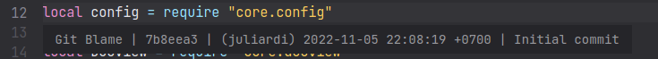

# Git Blame - Plugin for Lite XL

This plugin shows "git blame" information of a file. The blame information shown will include :
- Latest commit hash
- Latest commiter Username
- Latest commit date & time
- Latest commit message

This plugin is inspired by [Sublime Text's Git Blame Package](https://github.com/frou/st3-gitblame).

## Installation

Clone this repo into your `plugins` folder and rename the cloned folder to `gitblame`. The `plugins` folder is usually at `LITE_XL_CONFIG_DIR/plugins` (in case of linux, this is `~/.config/lite-xl/plugins`).
```
$ git clone https://github.com/juliardi/lite-xl-gitblame.git gitblame
```

## Configuration

You can configure this plugin by adding this snippet to `LITE_XL_CONFIG_DIR/init.lua` (in case of linux, this is `~/.config/lite-xl/init.lua`).

```lua
config.plugins.gitblame = {
  -- Text color of blame information
  text_color = {200, 140, 220},
  -- Font size of blame information
  font_size = 14,
  -- The commit message will be truncated if it is longer than this variable's value
  max_commit_message_length = 50,
  -- If debug = true, then this plugin will output a log which can be accessed
  -- from "Core : Open Log" command
  debug = false,
}
```

## Usage

- Open a file then navigate the cursor to a line
- Open command menu by pressing `ctrl`+`shift`+`p`
- Search `Git Blame : Toggle` and then press `enter`

- The git blame info will show under that line

